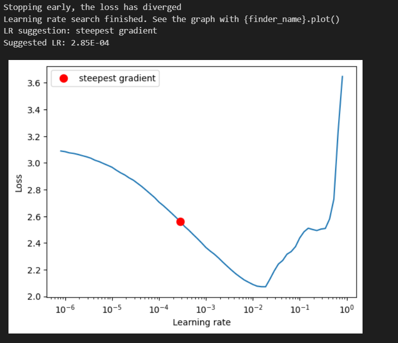
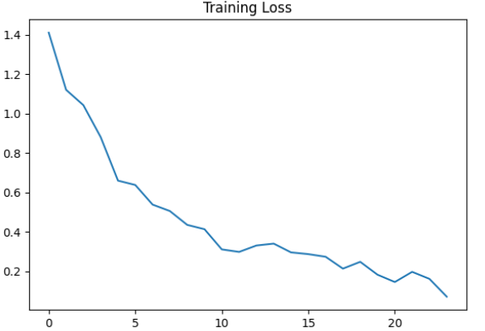
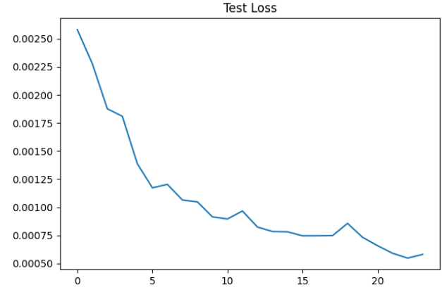
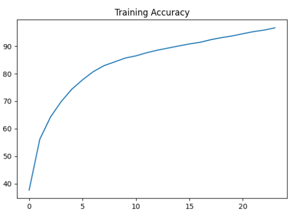
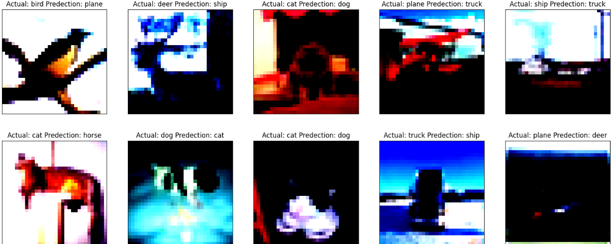
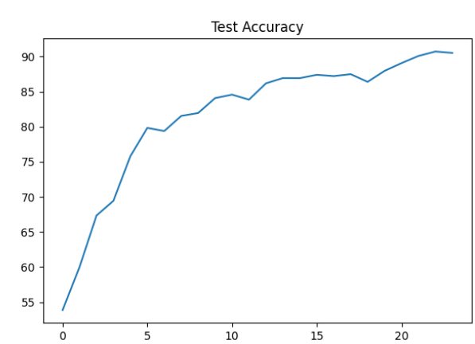

# Image Classification using LRfinder and One Cycle Policy

## Overview
This repository contains code for implementing LRfinder and One Cycle Policy in a Convolutional Neural Network (CNN) using PyTorch for image classification tasks on the CIFAR-10 dataset. The model architecture comprises a combination of regular convolutional layers and the ResNet-18 model. The dataset is split into training and testing sets, with data augmentation techniques applied during training to enhance model generalization.

## Findings
The code includes procedures for training and testing the model to evaluate its performance. It tracks and plots training and test losses, as well as training and test accuracies over epochs. Additionally, it provides visualizations of misclassified images along with their true and predicted labels to analyze the model's behavior.
- LRfinder is utilized to determine the maximum learning rate required to achieve the highest training and test accuracies.
- The One Cycle Policy is employed to reach high accuracy while using fewer resources and epochs.

## Graphs
### Several graphs are plotted to visualize the training and testing process:
1. Training Loss: 
2. Test Loss: 
3. Training Accuracy: 
4. Test Accuracy: 
### LRFinder and suggested max_LR
- 
### Collection of Misclassified Images
The code generates a collection of misclassified images along with their actual and predicted labels.

## Results
- Training Accuracy: 97.08
- Test Accuracy: 91.79

