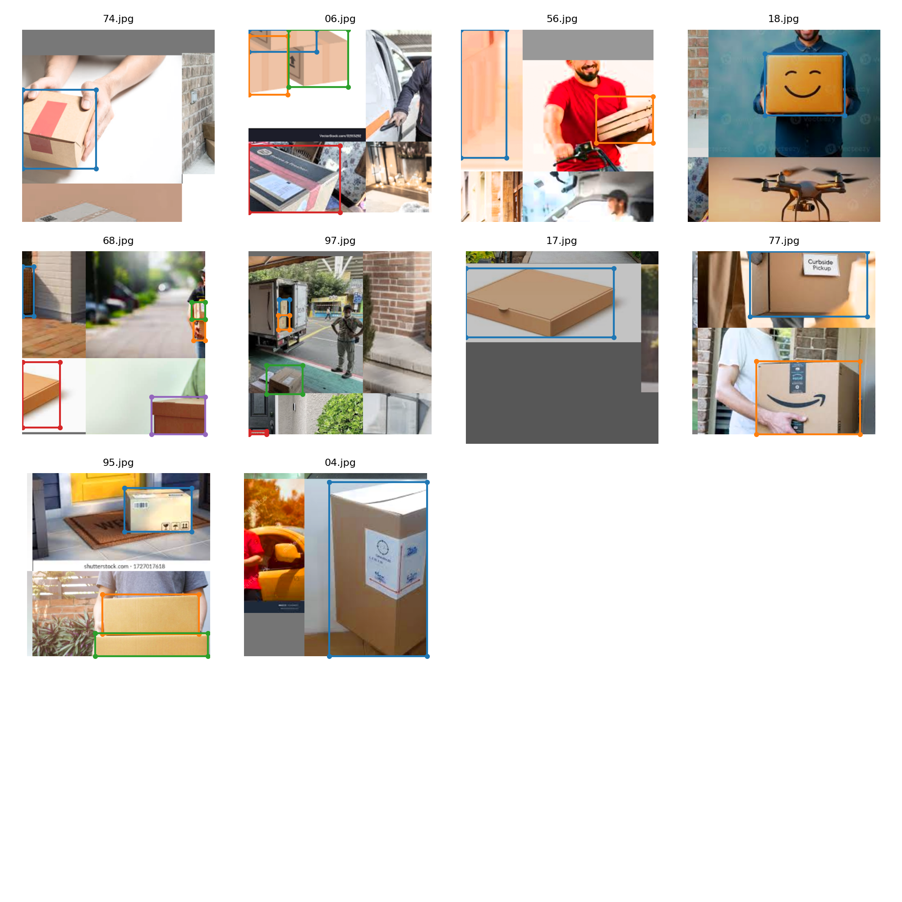

# YOLOv3 Object Detection

## Overview
This repository contains code for implementing YOLOv3 (You Only Look Once version 3), a state-of-the-art real-time object detection system, using PyTorch. YOLOv3 is known for its speed and accuracy, capable of detecting objects in images and videos swiftly. The model architecture utilizes a deep convolutional neural network to predict bounding boxes and class probabilities for multiple objects in a single pass.

## Features
- Implementation of YOLOv3 in PyTorch for object detection tasks.
- Pre-trained weights available for easy initialization and fine-tuning.
- Capable of detecting multiple objects of various classes in real-time.
- Supports both image and video input for object detection.

## Results
- YOLOv3 achieves high accuracy in real-time object detection tasks.
- The model is capable of detecting a wide range of object classes with minimal false positives.
- Object detection results can be visualized with bounding boxes and class labels overlaid on input images or videos.

## Side Remarks
- We took different types of delivery boxes and used an annotation tool to pre-train the labels and input for the YOLO_V3 code.

## Test Results
The test results are as follows:

## Train Results
The train results are as follows:

