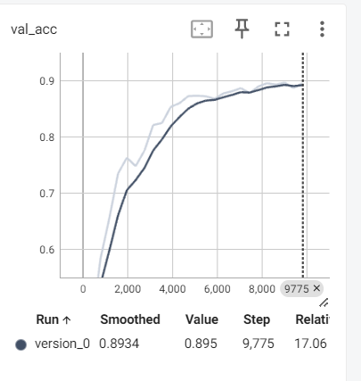

# Image Classification using Pytorch Lighting and Grad-cam 

## Overview
This repository contains code for implementing Pytorch lighting in a Convolutional Neural Network (CNN) using PyTorch for image classification tasks on the CIFAR-10 dataset. The model architecture comprises of the ResNet-18 model. The dataset is split into training and testing sets, with data augmentation techniques applied during training to enhance model generalization. Add grad-cam on the missclassified images to find where the specified layer focused areas

## Findings
The code includes procedures for training and testing the model to evaluate its performance. It tracks and plots training and test losses, as well as training and test accuracies over epochs. Additionally, it provides visualizations of misclassified images along with their true and predicted labels to analyze the model's behavior.

- Grad-cam help to find at perticuler layer where is the focus is on while detecting image.

## Graph

1. Validation Accuracy:  

### Collection of Misclassified Images
The code generates a collection of misclassified images along with their actual and predicted labels.

The code generates a collection of misclassified images along with their actual and predicted labels.

## Results
- Val_Accuracy: 89.49

link to for Assigment 13 : https://github.com/RInkalshah93/ERA-V2-Assignment_Rinkal-Shah/tree/625995b12003cdbd8fd8f404c7c055ff9f488950/S13_Assignment 
