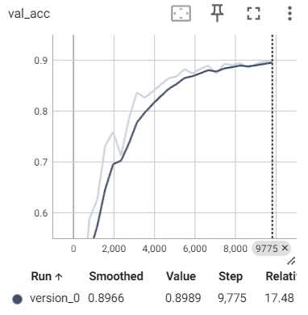
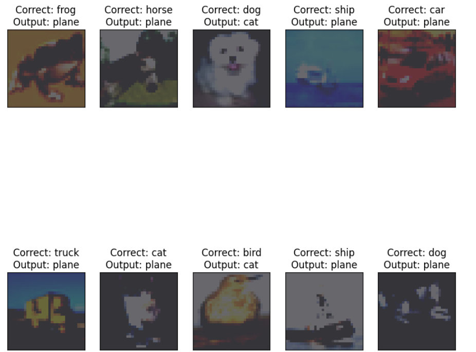
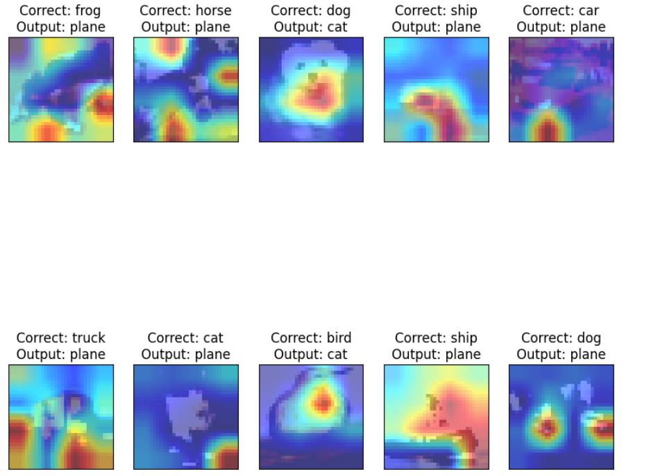

# Image Classification using Pytorch Lighting and Grad-cam 

## Overview
This repository contains code for implementing Pytorch lighting in a Convolutional Neural Network (CNN) using PyTorch for image classification tasks on the CIFAR-10 dataset. The model architecture comprises of the ResNet-18 model. The dataset is split into training and testing sets, with data augmentation techniques applied during training to enhance model generalization. Add grad-cam on the missclassified images to find where the specified layer focused areas

## Findings
The code includes procedures for training and testing the model to evaluate its performance. It tracks and plots training and test losses, as well as training and test accuracies over epochs. Additionally, it provides visualizations of misclassified images along with their true and predicted labels to analyze the model's behavior.

- Grad-cam help to find at perticuler layer where is the focus is on while detecting image.
## Model Summary

   | Name                | Type               | Params
------------------------------------------------------------
0  | conv1               | Conv2d             | 1.7 K 
1  | bn1                 | BatchNorm2d        | 128   
2  | layer1              | Sequential         | 147 K 
3  | layer1.0            | BasicBlock         | 74.0 K
4  | layer1.0.conv1      | Conv2d             | 36.9 K
5  | layer1.0.bn1        | BatchNorm2d        | 128   
6  | layer1.0.conv2      | Conv2d             | 36.9 K
7  | layer1.0.bn2        | BatchNorm2d        | 128   
8  | layer1.0.shortcut   | Sequential         | 0     
9  | layer1.1            | BasicBlock         | 74.0 K
10 | layer1.1.conv1      | Conv2d             | 36.9 K
11 | layer1.1.bn1        | BatchNorm2d        | 128   
12 | layer1.1.conv2      | Conv2d             | 36.9 K
13 | layer1.1.bn2        | BatchNorm2d        | 128   
14 | layer1.1.shortcut   | Sequential         | 0     
15 | layer2              | Sequential         | 525 K 
16 | layer2.0            | BasicBlock         | 230 K 
17 | layer2.0.conv1      | Conv2d             | 73.7 K
18 | layer2.0.bn1        | BatchNorm2d        | 256   
19 | layer2.0.conv2      | Conv2d             | 147 K 
20 | layer2.0.bn2        | BatchNorm2d        | 256   
21 | layer2.0.shortcut   | Sequential         | 8.4 K 
22 | layer2.0.shortcut.0 | Conv2d             | 8.2 K 
23 | layer2.0.shortcut.1 | BatchNorm2d        | 256   
24 | layer2.1            | BasicBlock         | 295 K 
25 | layer2.1.conv1      | Conv2d             | 147 K 
26 | layer2.1.bn1        | BatchNorm2d        | 256   
27 | layer2.1.conv2      | Conv2d             | 147 K 
28 | layer2.1.bn2        | BatchNorm2d        | 256   
29 | layer2.1.shortcut   | Sequential         | 0     
30 | layer3              | Sequential         | 2.1 M 
31 | layer3.0            | BasicBlock         | 919 K 
32 | layer3.0.conv1      | Conv2d             | 294 K 
33 | layer3.0.bn1        | BatchNorm2d        | 512   
34 | layer3.0.conv2      | Conv2d             | 589 K 
35 | layer3.0.bn2        | BatchNorm2d        | 512   
36 | layer3.0.shortcut   | Sequential         | 33.3 K
37 | layer3.0.shortcut.0 | Conv2d             | 32.8 K
38 | layer3.0.shortcut.1 | BatchNorm2d        | 512   
39 | layer3.1            | BasicBlock         | 1.2 M 
40 | layer3.1.conv1      | Conv2d             | 589 K 
41 | layer3.1.bn1        | BatchNorm2d        | 512   
42 | layer3.1.conv2      | Conv2d             | 589 K 
43 | layer3.1.bn2        | BatchNorm2d        | 512   
44 | layer3.1.shortcut   | Sequential         | 0     
45 | layer4              | Sequential         | 8.4 M 
46 | layer4.0            | BasicBlock         | 3.7 M 
47 | layer4.0.conv1      | Conv2d             | 1.2 M 
48 | layer4.0.bn1        | BatchNorm2d        | 1.0 K 
49 | layer4.0.conv2      | Conv2d             | 2.4 M 
50 | layer4.0.bn2        | BatchNorm2d        | 1.0 K 
51 | layer4.0.shortcut   | Sequential         | 132 K 
52 | layer4.0.shortcut.0 | Conv2d             | 131 K 
53 | layer4.0.shortcut.1 | BatchNorm2d        | 1.0 K 
54 | layer4.1            | BasicBlock         | 4.7 M 
55 | layer4.1.conv1      | Conv2d             | 2.4 M 
56 | layer4.1.bn1        | BatchNorm2d        | 1.0 K 
57 | layer4.1.conv2      | Conv2d             | 2.4 M 
58 | layer4.1.bn2        | BatchNorm2d        | 1.0 K 
59 | layer4.1.shortcut   | Sequential         | 0     
60 | linear              | Linear             | 5.1 K 
61 | accuracy            | MulticlassAccuracy | 0     
------------------------------------------------------------
11.2 M    Trainable params
0         Non-trainable params
11.2 M    Total params
44.696    Total estimated model params size (MB)

## Training Log 
    Epoch 24: 100% 391/391 [00:44<00:00,  8.79it/s, v_num=0, val_loss=-9.79, val_acc=0.899]
## Perfomace Graph
  

### Collection of Misclassified Images
The code generates a collection of misclassified images along with their actual and predicted labels.

The code generates a collection of misclassified images along with their actual and predicted labels.

## Results
- Val_Accuracy: 89.49

link to for Assigment 13 : https://github.com/RInkalshah93/ERA-V2-Assignment_Rinkal-Shah/tree/625995b12003cdbd8fd8f404c7c055ff9f488950/S13_Assignment 
