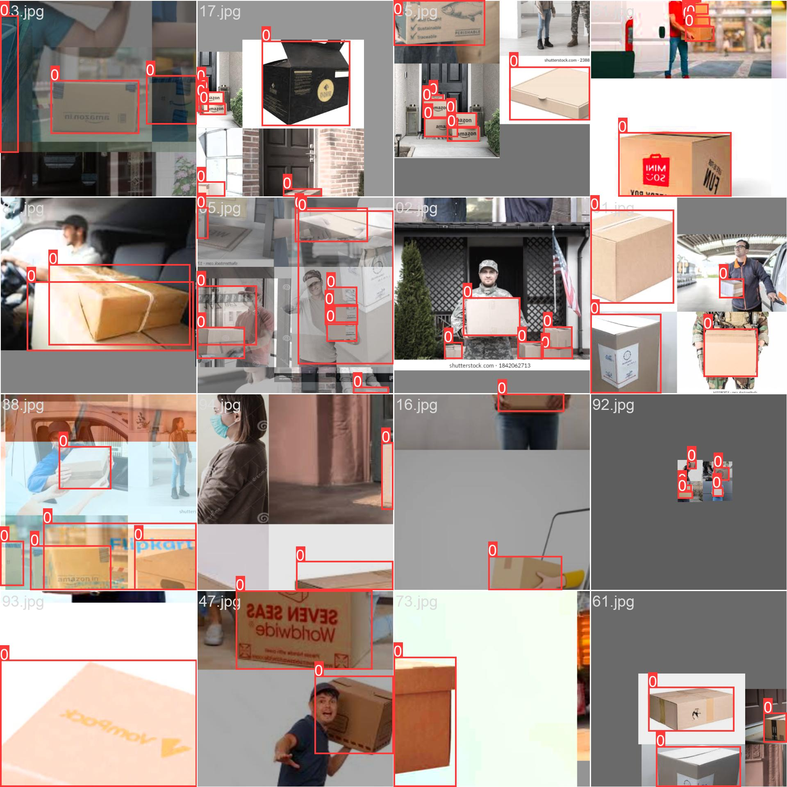

# Image detection using YOLOv9

## Introduction

The goal of this assigment to collect, create and annotate the Images for obejct detection. I selected the Delivery box images as dataset.

Start training of collected data using YOLOv9.

## Training Log

    Starting training for 25 epochs...

      Epoch    GPU_mem   box_loss   cls_loss   dfl_loss  Instances       Size
       0/24      11.1G      1.085      3.646      1.364         14        640: 1
                 Class     Images  Instances          P          R      mAP50   
                   all        100        145      0.268      0.152      0.106     0.0729

      Epoch    GPU_mem   box_loss   cls_loss   dfl_loss  Instances       Size
       1/24      13.4G     0.9215      2.736      1.255         18        640: 1
                 Class     Images  Instances          P          R      mAP50   
                   all        100        145      0.784      0.538       0.66       0.56

      Epoch    GPU_mem   box_loss   cls_loss   dfl_loss  Instances       Size
       2/24      13.4G     0.8007      1.477      1.203         14        640: 1
                 Class     Images  Instances          P          R      mAP50   
                   all        100        145      0.922      0.815      0.878      0.725

      Epoch    GPU_mem   box_loss   cls_loss   dfl_loss  Instances       Size
       3/24      13.4G     0.8724       1.23      1.275         15        640: 1
                 Class     Images  Instances          P          R      mAP50   
                   all        100        145      0.875      0.862      0.912      0.742

      Epoch    GPU_mem   box_loss   cls_loss   dfl_loss  Instances       Size
       4/24      13.4G     0.7802     0.8908      1.145         21        640: 1
                 Class     Images  Instances          P          R      mAP50   
                   all        100        145      0.937      0.834      0.913      0.727

      Epoch    GPU_mem   box_loss   cls_loss   dfl_loss  Instances       Size
       5/24      13.4G     0.7379     0.8772      1.117         27        640: 1
                 Class     Images  Instances          P          R      mAP50   
                   all        100        145      0.984      0.834      0.926      0.756

      Epoch    GPU_mem   box_loss   cls_loss   dfl_loss  Instances       Size
       6/24      13.4G     0.7732     0.7225      1.125         15        640: 1
                 Class     Images  Instances          P          R      mAP50   
                   all        100        145      0.865      0.766      0.851      0.679

      Epoch    GPU_mem   box_loss   cls_loss   dfl_loss  Instances       Size
       7/24      13.4G      0.779     0.7791      1.108         12        640: 1
                 Class     Images  Instances          P          R      mAP50   
                   all        100        145      0.977      0.814      0.933      0.723

      Epoch    GPU_mem   box_loss   cls_loss   dfl_loss  Instances       Size
       8/24      13.4G     0.7075     0.6284       1.06         21        640: 1
                 Class     Images  Instances          P          R      mAP50   
                   all        100        145      0.879      0.853      0.911      0.717

      Epoch    GPU_mem   box_loss   cls_loss   dfl_loss  Instances       Size
       9/24      13.4G     0.8058      0.691      1.167         10        640: 1
                 Class     Images  Instances          P          R      mAP50   
                   all        100        145      0.918      0.834      0.901      0.698
    Closing dataloader mosaic

      Epoch    GPU_mem   box_loss   cls_loss   dfl_loss  Instances       Size
      10/24      13.4G     0.6749      0.791      1.048          7        640: 1
                 Class     Images  Instances          P          R      mAP50   
                   all        100        145      0.877      0.837      0.917      0.765

      Epoch    GPU_mem   box_loss   cls_loss   dfl_loss  Instances       Size
      11/24      13.4G     0.6728     0.6462      1.043          5        640: 1
                 Class     Images  Instances          P          R      mAP50   
                   all        100        145      0.861      0.724      0.842      0.632

      Epoch    GPU_mem   box_loss   cls_loss   dfl_loss  Instances       Size
      12/24      13.4G     0.6842     0.6993       1.06          8        640: 1
                 Class     Images  Instances          P          R      mAP50   
                   all        100        145       0.84      0.683      0.799      0.567

      Epoch    GPU_mem   box_loss   cls_loss   dfl_loss  Instances       Size
      13/24      13.4G     0.7538     0.7095      1.081          8        640: 1
                 Class     Images  Instances          P          R      mAP50   
                   all        100        145      0.632      0.722      0.703      0.511

      Epoch    GPU_mem   box_loss   cls_loss   dfl_loss  Instances       Size
      14/24      13.4G     0.6338     0.6489      1.006          4        640: 1
                 Class     Images  Instances          P          R      mAP50   
                   all        100        145      0.813      0.738      0.834      0.626

      Epoch    GPU_mem   box_loss   cls_loss   dfl_loss  Instances       Size
      15/24      13.4G     0.7712     0.7395      1.096          5        640: 1
                 Class     Images  Instances          P          R      mAP50   
                   all        100        145      0.854      0.745      0.865      0.672

      Epoch    GPU_mem   box_loss   cls_loss   dfl_loss  Instances       Size
      16/24      13.4G     0.7519     0.7886       1.16          4        640: 1
                 Class     Images  Instances          P          R      mAP50   
                   all        100        145      0.718      0.683       0.76      0.595

      Epoch    GPU_mem   box_loss   cls_loss   dfl_loss  Instances       Size
      17/24      13.4G     0.7398     0.7392      1.094          4        640: 1
                 Class     Images  Instances          P          R      mAP50   
                   all        100        145      0.762      0.683      0.734      0.539

      Epoch    GPU_mem   box_loss   cls_loss   dfl_loss  Instances       Size
      18/24      13.4G     0.7491      0.641      1.137          6        640: 1
                 Class     Images  Instances          P          R      mAP50   
                   all        100        145      0.852      0.676       0.79      0.604

      Epoch    GPU_mem   box_loss   cls_loss   dfl_loss  Instances       Size
      19/24      13.4G     0.7493     0.5848       1.12          6        640: 1
                 Class     Images  Instances          P          R      mAP50   
                   all        100        145      0.837      0.772       0.84      0.652

      Epoch    GPU_mem   box_loss   cls_loss   dfl_loss  Instances       Size
      20/24      13.4G     0.6744      0.608      1.093          4        640: 1
                 Class     Images  Instances          P          R      mAP50   
                   all        100        145      0.864      0.787      0.888      0.699

      Epoch    GPU_mem   box_loss   cls_loss   dfl_loss  Instances       Size
      21/24      13.4G     0.6771     0.5759      1.086          4        640: 1
                 Class     Images  Instances          P          R      mAP50   
                   all        100        145      0.904      0.906      0.946       0.78

      Epoch    GPU_mem   box_loss   cls_loss   dfl_loss  Instances       Size
      22/24      13.4G     0.6421     0.6139       1.04          6        640: 1
                 Class     Images  Instances          P          R      mAP50   
                   all        100        145      0.881      0.945      0.962      0.811

      Epoch    GPU_mem   box_loss   cls_loss   dfl_loss  Instances       Size
      23/24      13.4G        0.7      0.527      1.077          7        640: 1
                 Class     Images  Instances          P          R      mAP50   
                   all        100        145      0.937      0.928      0.977      0.825

      Epoch    GPU_mem   box_loss   cls_loss   dfl_loss  Instances       Size
      24/24      13.4G     0.6776     0.4859      1.001          9        640: 1
                 Class     Images  Instances          P          R      mAP50   
                   all        100        145      0.939       0.95       0.98      0.834

## Perfomance Graph

    

## EC-2 Training 

    

    

    

    
</div

## Gradio App Link

[Deliver box Detection](https://huggingface.co/spaces/Rinkal4/Delivery_box_detection)

