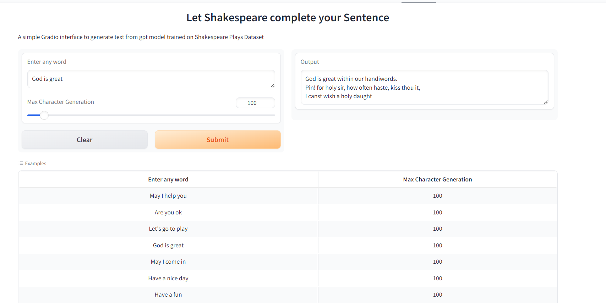

# Assignment
1. Your assignment is to write the train nanoGPT model for language generation task.
2. Upload the model to HuggingFace Apps. 

# Introduction
The goal of this assignment is to follow the Andrej Karpathy's
[video](https://www.youtube.com/watch?v=kCc8FmEb1nY&t=2s) to train language generation model and
deploy it on HuggingFace.

## Training log
    2.740289 M Parameters
    step 0: train loss 4.3394, val loss 4.3450
    step 500: train loss 1.6828, val loss 1.8451
    step 1000: train loss 1.4096, val loss 1.6313
    step 1500: train loss 1.2964, val loss 1.5418
    step 2000: train loss 1.2363, val loss 1.5064
    step 2500: train loss 1.1902, val loss 1.4944
    step 3000: train loss 1.1583, val loss 1.4921
    step 3500: train loss 1.1265, val loss 1.4893
    step 4000: train loss 1.1005, val loss 1.4879
    step 4500: train loss 1.0782, val loss 1.4753
    step 4999: train loss 1.0556, val loss 1.4788

    GLOUCESTER:
    My second lords of Ely good part Gaunt:
    And that same, contented them, now each to speak.

    RIVERS:
    Why; had your honour at the morning with fury?

    QUEEN MARGARET:
    At any son: as her made I have that defended.

    WARWICK:
    This is matter, Duke of York; and loy at Salisbury.

    HASTINGS:
    Now, Auropen, my lady monship
    Is not belong.

    GLOUCESTER:
    The place where thou laudest away! I'll character
    He wearing thee merinely: and the which the rage
    As sport, for't.

    KING EDWARD IV:
    Like mean to k

## Metrics
val loss: 1.4788

## Gradio App
 
Gradio App can be found [here](https://huggingface.co/spaces/Rinkal4/microGPT_text)

## Acknowledgments
This model is trained using repo listed below
* [mocroGPT_text](https://github.com/RInkalshah93/ERA-V2-Assignment_Rinkal-Shah/tree/c56eaa84e0566fb54ad739f4e62944c6fd0dd365/S19_Assignment)