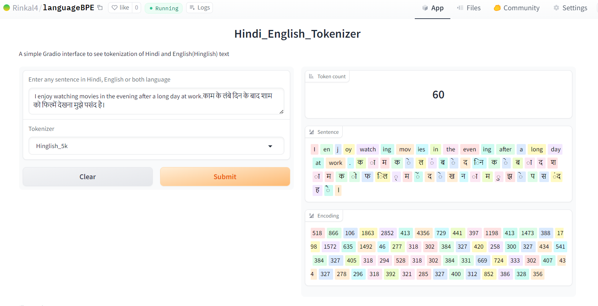

# Assignment
1. Pick any "Indian" language of your choice
2. Build your own BPE for this language that satisfies these statistics:
    1. it must have 5000+ tokens in its vocabulary
    2. it must have a compression ratio of 3 or above
3. Once done:
    1. Share your GitHub link where we can find the training notebook
    2. Upload to HuggingFace (with examples) where we can run your tokenizer

# Introduction
The goal of this assignment is to collect text data of any indian language. Write regext to split
data properly. Build a BPE tokenizer with 5000+ tokens. Final compression should be greater than 3.

## Build logs
### English
    Merging hindi characters in single token
    100%|██████████| 128/128 [00:13<00:00,  9.82it/s]
    Building BPE
    merge 1/4616: (32, 116) -> 384 ( t) had 5285 occurrences
    merge 2/4616: (384, 104) -> 385 ( th) had 3546 occurrences
    merge 3/4616: (32, 97) -> 386 ( a) had 3368 occurrences
    merge 4/4616: (105, 110) -> 387 (in) had 3021 occurrences
    merge 5/4616: (101, 114) -> 388 (er) had 2463 occurrences
    merge 6/4616: (32, 119) -> 389 ( w) had 2295 occurrences
    merge 7/4616: (32, 111) -> 390 ( o) had 2054 occurrences
    ...
    merge 4611/4616: (4993, 473) -> 4994 ( Potter) had 2 occurrences
    merge 4612/4616: (573, 432) -> 4995 (allow) had 2 occurrences
    merge 4613/4616: (418, 1255) -> 4996 ( lands) had 2 occurrences
    merge 4614/4616: (632, 729) -> 4997 ( enorm) had 2 occurrences
    merge 4615/4616: (4997, 566) -> 4998 ( enormous) had 2 occurrences
    merge 4616/4616: (548, 98) -> 4999 ( orb) had 2 occurrences
    Compression ratio: 4.146210217755444
    Training took 792.27 seconds

### Hindi
    Spliting hindi words
    100%|██████████| 44243/44243 [00:00<00:00, 102102.70it/s]
    Merging hindi characters in single token
    100%|██████████| 128/128 [00:22<00:00,  5.79it/s]
    Building BPE
    merge 1/4616: (32, 277) -> 384 ( क) had 6198 occurrences
    merge 2/4616: (32, 313) -> 385 ( ह) had 4157 occurrences
    merge 3/4616: (32, 312) -> 386 ( स) had 3089 occurrences
    merge 4/4616: (32, 302) -> 387 ( म) had 2428 occurrences
    merge 5/4616: (385, 328) -> 388 ( है) had 2188 occurrences
    merge 6/4616: (32, 298) -> 389 ( प) had 1853 occurrences
    merge 7/4616: (32, 284) -> 390 ( ज) had 1627 occurrences
    ...
    merge 4611/4616: (709, 479) -> 4994 ( खुले) had 2 occurrences
    merge 4612/4616: (2419, 467) -> 4995 ( किराये) had 2 occurrences
    merge 4613/4616: (608, 289) -> 4996 ( बेड) had 2 occurrences
    merge 4614/4616: (2267, 318) -> 4997 ( पढा) had 2 occurrences
    merge 4615/4616: (410, 2909) -> 4998 ( नुक्) had 2 occurrences
    merge 4616/4616: (33, 692) -> 4999 (!"
    ) had 2 occurrences
    100%|██████████| 4616/4616 [15:17<00:00,  5.03it/s]
    Compression ratio: 3.4400907552130224
    Training took 940.21 seconds
### Hindi and English(Hinglish)
    SSpliting hindi words
    100%|██████████| 85623/85623 [00:01<00:00, 58278.09it/s]
    Merging hindi characters in single token
    100%|██████████| 128/128 [00:44<00:00,  2.90it/s]
    Building BPE
    merge 1/4616: (32, 277) -> 384 ( क) had 6198 occurrences
    merge 2/4616: (32, 116) -> 385 ( t) had 5286 occurrences
    merge 3/4616: (32, 313) -> 386 ( ह) had 4157 occurrences
    merge 4/4616: (385, 104) -> 387 ( th) had 3547 occurrences
    merge 5/4616: (32, 97) -> 388 ( a) had 3368 occurrences
    merge 6/4616: (32, 312) -> 389 ( स) had 3089 occurrences
    merge 7/4616: (105, 110) -> 390 (in) had 3025 occurrences
    ...
    merge 4611/4616: (448, 1729) -> 4994 ( तर्क) had 5 occurrences
    merge 4612/4616: (327, 1580) -> 4995 (ेक्षा) had 5 occurrences
    merge 4613/4616: (446, 1337) -> 4996 ( आसान) had 5 occurrences
    merge 4614/4616: (280, 318) -> 4997 (घा) had 5 occurrences
    merge 4615/4616: (423, 552) -> 4998 ( अनी) had 5 occurrences
    merge 4616/4616: (389, 1021) -> 4999 ( सजा) had 5 occurrences
    100%|██████████| 4616/4616 [27:23<00:00,  2.81it/s]
    Compression ratio: 3.3390204340848433
    Training took 1689.24 seconds
## Metrics
Compression ratio for Hindi: 4.14
Compression rario for Hinglish: 3.44
Compression ratio for English: 3.33

## Gradio App

Gradio App can be found [here](https://huggingface.co/spaces/Rinkal4/languageBPE)

## Acknowledgments
This model is trained using repo listed below
* [languageBPE](https://github.com/RInkalshah93/language_bpe_Hindi_English)