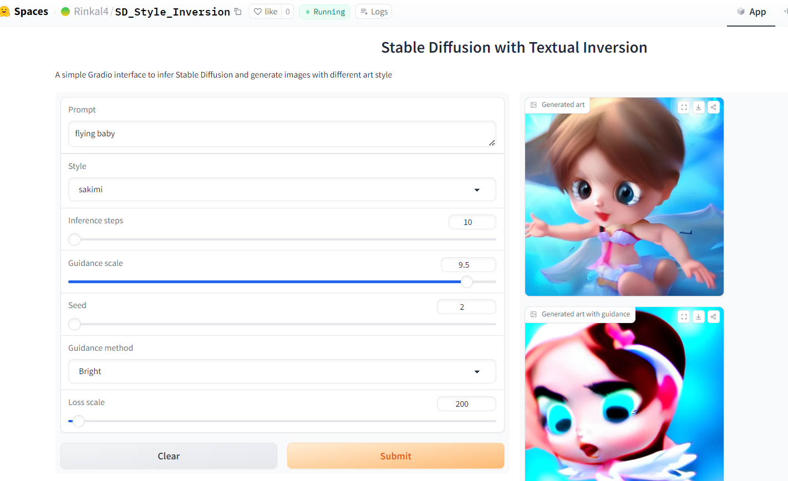

# Assignment
1. Select 5 different styles from community-created SD concepts library.
2. Apply these styles on prompt and show output.
3. Apply guidance loss on same prompt and show output.
4. Create a hugging face app.

# Introduction
The goal of this assignment is to use stable diffusion for image generation. Use different style
embeddings to generate output. Use gudance loss function to guide image generation in specific
direction.

## :golfing: Guidance loss

- Grayscale: To make some part of image black and white. 
- Bright: To increase bright colors in image.

## Gradio App
  
Gradio App can be found [here](https://huggingface.co/spaces/Rinkal4/SD_Style_Inversion)

## Acknowledgments
This assignement is refering to code given in repo listed below
* [Stable Diffusion Deep Dive](https://github.com/fastai/diffusion-nbs)