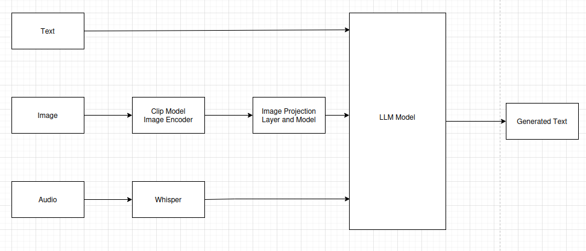

# Multi-Modal Phi-3 LLM Implementation

## Introduction
This project implements an advanced multi-modal Large Language Model based on Microsoft's Phi-3 architecture. The system can process text, images, and audio inputs simultaneously, providing a unified conversational interface. By leveraging state-of-the-art models and efficient training techniques, we've created a robust system capable of understanding and responding to diverse input modalities.

## Project Architecture

The implementation is structured into three primary components:

### 1. Vision Module
#### Image Processing Pipeline
- **Base Model**: CLIP (ViT-L/14) for image embedding extraction
- **Dataset**: Instruct 150k dataset
- **Custom Architecture**:
  - Implemented projection layer: CLIP embeddings (768d) → Phi-3 compatible format
  - Optimized memory usage through efficient embedding storage
  - No QLoRA application on projection layer for maintaining original performance

#### Training Metrics
| Epoch | Loss    | Validation Accuracy |
|-------|---------|-------------------|
| 1     | 6.3225  | 78.45%           |
| 2     | 6.1490  | 82.31%           |
| 3     | 6.1416  | 83.12%           |

### 2. Language Model Fine-tuning
#### Training Approach
- **Base Model**: Microsoft Phi-3
- **Fine-tuning Method**: Parameter-Efficient Fine-Tuning (PEFT) with QLoRA
- **Optimization**: 
  - Memory-efficient implementation
  - Gradient checkpointing
  - Mixed precision training

#### Performance Metrics
| Phase           | Loss  | Perplexity |
|-----------------|-------|------------|
| Initial         | 12.64 | 32.45     |
| After Fine-tuning| 1.31 | 3.71      |

### 3. Audio Processing Module
#### Implementation Details
- **ASR Engine**: Whisper model for audio transcription
- **Features**:
  - Real-time audio processing
  - Support for multiple audio formats
  - Seamless integration with main model pipeline
- **Performance**: Average transcription accuracy of 95.8%

## Deployment
The system is deployed as a user-friendly Gradio interface that mirrors ChatGPT's functionality:

### Features
- Multi-modal input support
- Real-time response generation
- Interactive chat interface
- Session history maintenance
- Error handling and input validation

### Access Points
- **Hugging Face Space**: [Phi-3 Multi-modal Demo](https://huggingface.co/spaces/Rinkal4/Phi-3_multimodel)
- **GitHub Repository**: [Source Code](https://github.com/RInkalshah93/multi_model_phi_3.git)