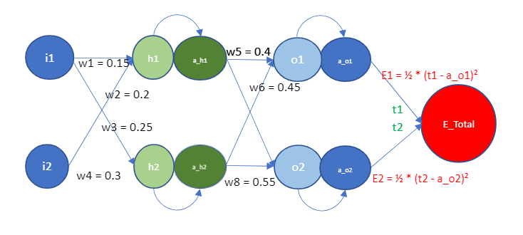
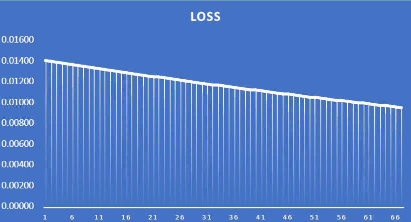
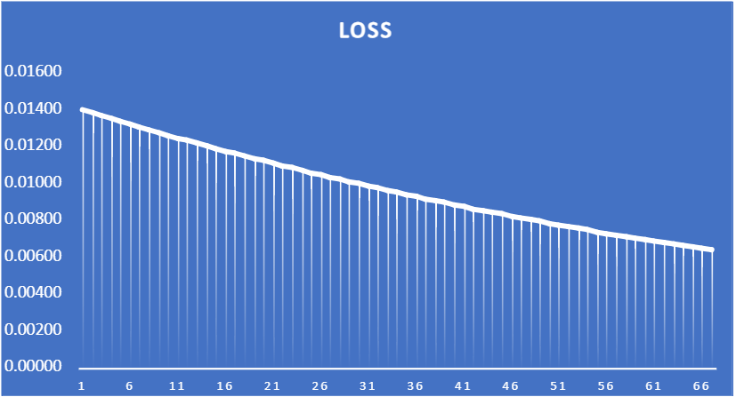
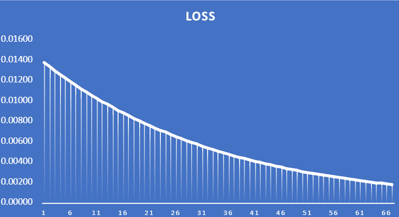
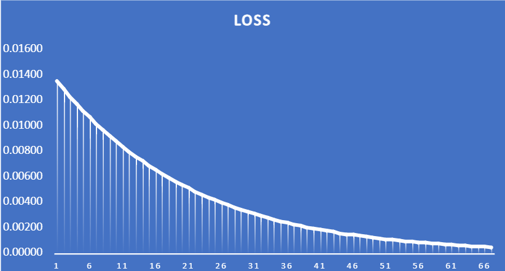
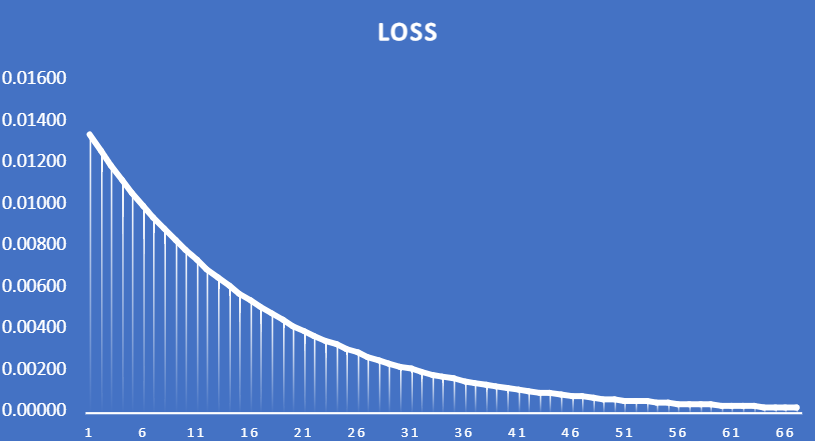
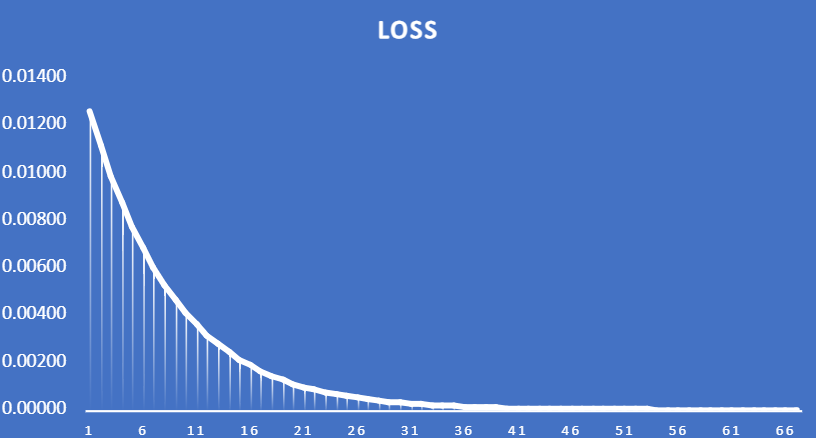

# Backpropagation for 2 Input and 2 Output Neural Network

Backpropagation is a concept in training neural networks. It involves adjusting the weights of the connections between neurons to minimize the difference between the actual output and the desired output. This process is crucial for the network to learn and improve its performance over time.

## Introduction

In this case, we are taking 2 inputs and 2 desired outputs to learn different details that are used in backpropagation. We will follow the diagram provided below for calculating the output.

## Diagram

## Details

- We have 2 inputs and 2 sets of 4 weights to reach the desired output.
- After the initial calculation, the outputs of h1 and h2 will be determined using the following formulas:

  - h1 = (w1 * i1) + (w2 * i2)
  - h2 = (w3 * i1) + (w4 * i2)

  - Where:
    - w: weight value
    - i: input value

- After calculating the values of h1 and h2, we will apply the sigmoid function as an activation function. The sigmoid function introduces non-linearity and squashes the output values between 0 and 1, making them suitable for representing probabilities.

- The outputs of o1 and o2 will be determined using the following formulas:

  - o1 = (w5 * a_h1) + (w6 * a_h2)
  - o2 = (w7 * a_h1) + (w8 * a_h2)

  - Where:
    - w: weight value
    - a_h1, a_h2: Activated outputs from the hidden layer

- After calculating the values of o1 and o2, we will apply the sigmoid function as an activation function to obtain the final outputs.

- We are going to calculate the error with respect to our desired output:
    - E_Total = E1 + E2
    - E1 = 1/2 * (t1 - a_o1)^2
    - E2 = 1/2 * (t2 - a_o2)^2

  - Where:
    - E_Total: Total error, the sum of individual errors (E1 and E2).
    - E1, E2: Individual errors for each output neuron, calculated as the squared difference between the target output (t) and the actual output (a_o).

## Backpropagation

Now, we are going to calculate the backpropagation using partial derivatives. Backpropagation updates the weights of the neural network by propagating the error gradient backward from the output layer to the input layer, allowing the network to learn and improve its performance over time.

Here are the formulas for calculating the partial derivatives and updating the weights during backpropagation:

- dE_total/dw5 = ((a_o1 - t1) * a_o1 * (1 - a_o1) * a_h1)
- dE_total/dw6 = ((a_o1 - t1) * a_o1 * (1 - a_o1) * a_h2)
- dE_total/dw7 = ((a_o2 - t2) * a_o2 * (1 - a_o2) * a_h1)
- dE_total/dw8 = ((a_o2 - t2) * a_o2 * (1 - a_o2) * a_h2)

- dE_total/da_h1 = (((a_o1 - t1) * a_o1 * (1 - a_o1) * w5) + ((a_o2 - t2) * a_o2 * (1 - a_o2) * w7))
- dE_total/da_h2 = (((a_o1 - t1) * a_o1 * (1 - a_o1) * w6) + ((a_o2 - t2) * a_o2 * (1 - a_o2) * w8))

- dE_total/dw1 = (((a_o1 - t1) * a_o1 * (1 - a_o1) * w5) + ((a_o2 - t2) * a_o2 * (1 - a_o2) * w7)) * a_h1 * (1 - a_h1) * i1
- dE_total/dw2 = (((a_o1 - t1) * a_o1 * (1 - a_o1) * w5) + ((a_o2 - t2) * a_o2 * (1 - a_o2) * w7)) * a_h1 * (1 - a_h1) * i2
- dE_total/dw3 = (((a_o1 - t1) * a_o1 * (1 - a_o1) * w6) + ((a_o2 - t2) * a_o2 * (1 - a_o2) * w8)) * a_h2 * (1 - a_h2) * i1
- dE_total/dw4 = (((a_o1 - t1) * a_o1 * (1 - a_o1) * w6) + ((a_o2 - t2) * a_o2 * (1 - a_o2) * w8)) * a_h2 * (1 - a_h2) * i2

After calculating the partial derivatives, we update the weights using the learning rate (η). Here are the update equations for each weight:

- new w1 = w1 - η * dE_total/dw1
- new w2 = w2 - η * dE_total/dw2
- new w3 = w3 - η * dE_total/dw3
- new w4 = w4 - η * dE_total/dw4
- new w5 = w5 - η * dE_total/dw5
- new w6 = w6 - η * dE_total/dw6
- new w7 = w7 - η * dE_total/dw7
- new w8 = w8 - η * dE_total/dw8

## Learning Rate chart for different value of η

Below are the different learning Rate charts for different values of η:

### η = 0.1

### η = 0.2

### η = 0.5

### η = 0.8

### η = 1.0

### η = 2.0

