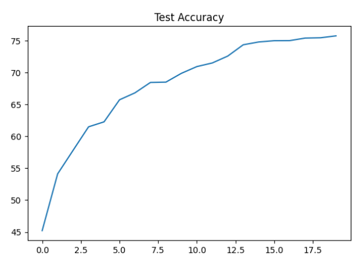

# Different Normalization Techniques and Their Findings

## Code Description
The code provided here implements a Convolutional Neural Network (CNN) using PyTorch for image classification tasks on the CIFAR-10 dataset. The architecture of the model consists of several convolutional layers followed by batch normalization/layer normalization/group normalization, ReLU activation, and dropout regularization. The dataset is split into training and testing sets, with data augmentation techniques applied during training to improve model generalization.

## Normalization Techniques
Various normalization techniques are applied to the input images:
- Random Rotation: Randomly rotates the images within a specified range to augment the dataset.
- Random Horizontal Flip: Randomly flips the images horizontally to introduce additional variations.
- Normalization: Normalizes the pixel values of the images to have a mean of 0.5 and a standard deviation of 0.5.

## Findings
The code includes training and testing procedures to train the model and evaluate its performance. It tracks and plots the training and test losses, as well as the training and test accuracies over epochs. Additionally, it visualizes misclassified images along with their true and predicted labels to analyze the model's behavior.
- The easiest model to train and test is batch normalization and it is easy to learn. We can keep the learning rate and step size low in batch normalization compared to other normalizations like layer and group normalization.
- Group normalization uses the same amount of parameters, but that also depends on the number of groups we use. We have to increase the learning rate and step size to get a good result.
- Layer normalization increases the parameters significantly, so we used group normalization and kept the channel size and number of groups the same so theoretically it is the same. But we have to increase the learning rate compared to the rest two normalizations to increase accuracy to 70%.

## Graphs
Several graphs are plotted to visualize the training and testing process:
### Batch Normalization:
1. Training Loss: 
2. Test Loss: 
3. Training Accuracy: 
4. Test Accuracy: 

### Group Normalization:
1. Training Loss: 
2. Test Loss: 
3. Training Accuracy: 
4. Test Accuracy: 

### Layer Normalization:
1. Training Loss: 
2. Test Loss: 
3. Training Accuracy: 
4. Test Accuracy: 

## Collection of Misclassified Images
The code generates a collection of misclassified images along with their actual and predicted labels.
1. Batch Normalization : 
2. Group Normalization : 
3. Layer Normalization : 

## Training Accuracy for 3 Models
The training accuracy is computed and displayed for the provided model.
1. Batch Normalization : 70.90
2. Group Normalization : 75.77
3. Layer Normalization : 67.47

## Test Accuracy for 3 Models
The test accuracy is computed and presented for the provided model.
1. Batch Normalization : 71.56
2. Group Normalization : 72.35
3. Layer Normalization : 72.07
